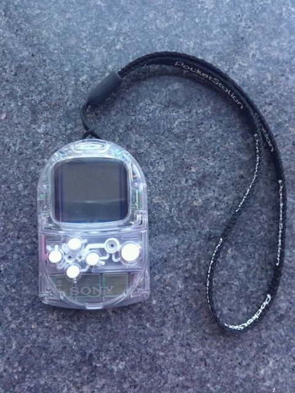
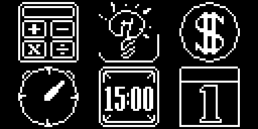
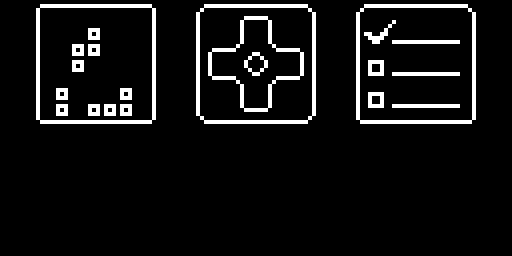

# Pocket PDA (UNDER DEVELOPMENT)

**Copyright (C) 2017 [Wang Renxin](https://github.com/paladin-t/). All rights reserved.**

## Introduction

Pocket PDA is an OS for the Arduboy with some useful utilities, which turns your Arduboy into a PDA.

Remember the PocketStation?

## Installation

### 1. Use the precompiled

* Use an Arduboy uploader to upload the `/out/pocket_pda.hex` to your Arduboy.
* Or use an Arduboy manager to upload the `/out/pocket_pda.arduboy` package.

### 2. Use the sketch

* Make sure you have the Arduino IDE installed and the Arduboy board package installed and selected.
* Open the `/pocket_pda/pocket_pda.ino` sketch with the Arduino IDE.
* Compile and upload the sketch.

## Functionalities

### 1. Calculator

A basic math calculator App.

* `D-Pad` to move the cursor.
* `A` to press a button.
* `B` to clear result, or exit the App if not resulted.

### 2. Flashlight

IN PLAN

### 3. Finances

IN PLAN

### 4. Chronograph

IN PLAN

### 5. Countdown

IN PLAN

### 6. Calendar

IN PLAN

### 7. Games

IN PLAN

### 8. Controller

IN PLAN

### 9. Todo

IN PLAN
