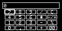
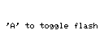
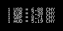
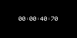
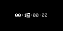
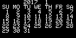
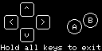

# Pocket PDA

**Copyright (C) 2017 [Wang Renxin](https://github.com/paladin-t/). All rights reserved.**

## Introduction

Pocket PDA is an OS for the Arduboy with some useful utilities, which turns your Arduboy into a PDA.

Remember the PocketStation?

## Installation

### 1. Use the precompiled

* Use an Arduboy uploader to upload the `/out/pocket_pda.hex` to your Arduboy.
* Or use an Arduboy manager to upload the `/out/pocket_pda.arduboy` package.

### 2. Use the sketch

* Make sure you have the Arduino IDE installed and the Arduboy board package installed and selected.
* Open the `/pocket_pda/pocket_pda.ino` sketch with the Arduino IDE.
* Compile and upload the sketch.

## Applications

### 1. Calculator

A basic math calculator App.

* `D-Pad` to move the cursor.
* `A` to press a button.
* `B` to clear result, or exit the App if not resulted.

### 2. Flashlight

A flashlight App.

* `UP`/`DOWN` to modify flash interval.
* `A` to toggle flash.
* `B` to exit the App.

### 3. Exchange Rate

An exchange rate App.

* `B` to exit the App.

### 4. Chronograph

A chronograph App.

* `A` to start or stop ticking.
* `B` to clear record, or exit the App if no record.

It can ticks at background.

### 5. Countdown

A countdown App.

* `UP`/`DOWN` to modify the time set.
* `LEFT`/`RIGHT` to move the cursor.
* `A` to toggle start/paused ticking.
* `B` to exit the App.

It turns to the flashlight screen when timeout.

It can ticks at background.

### 6. Calendar

A calendar App.

* `UP`/`DOWN` to change month.
* `LEFT`/`RIGHT` to change year.
* `B` to exit the App.

### 7. Controller

A simulated keyboard App, can be used as a game controller.

* `D-Pad` to simulate the arrow keys.
* `A` to simulate the `HOME` key.
* `B` to simulate the `END` key.

Hold all keys to exit the controller App.
